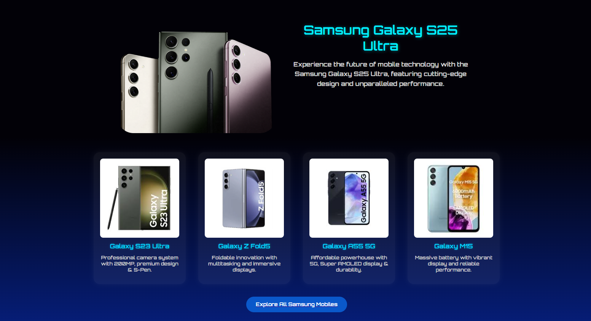

# Swag Offer Page

A visually engaging, responsive offer page designed with a vibrant swag theme. This page uses modern CSS techniques such as linear gradients, responsive typography, shadows, flexbox, and the CSS box model to create a rich UI suitable for promotional content.

## Assignment Output

### Assignment Output

| View Type        | Screenshot 1                               | Screenshot 2                               | Screenshot 3                               |
| ---------------- | ------------------------------------------ | ------------------------------------------ | ------------------------------------------ |
| **Desktop View** |  |  |  |
| **Mobile View**  |    |    |    |


## Overview

The **Swag Offer Page** is built using HTML and CSS, emphasizing:
- Clean structure
- Responsiveness across devices
- Vibrant color themes and glow effects
- Professional layout using Flexbox and Grid
- Modern font scaling with `clamp()`
- Emphasis on box model understanding for proper spacing and structure

This project is ideal for beginners to intermediate developers who want to explore interactive UI with stylistic flair.

## Concepts Used

| Concept | Description |
|--------|-------------|
| **Box Model** | Core layout model involving content, padding, border, and margin |
| **Flexbox** | CSS module used for flexible layouts and alignment |
| **Responsive Typography** | Achieved using `clamp()` for dynamic font resizing |
| **Box Shadow** | Adds depth and realism to cards and sections |
| **Text Shadow** | Adds glow or depth to text for better visual impact |
| **Media Queries** | Ensures design responsiveness across various screen sizes |
| **Gradient Backgrounds** | Used to enhance visual appeal with layered color transitions |

## Box Model Diagram (Mermaid)


The Box Model visually wraps around the content in the following order:

* **Content**: The actual element (text/image)
* **Padding**: Clears an area around the content (inside border)
* **Border**: Encloses padding and content
* **Margin**: Clears area outside the border (space from other elements)

## Code Explanation Highlights

### `box-sizing: border-box;`

This ensures the padding and border are included in the total width and height of the element, which simplifies layout calculations and avoids overflow.

```css
* {
  box-sizing: border-box;
}
```

### `font-size: clamp(1rem, 2.5vw, 1.2rem);`

This sets the font size to scale with the viewport width (`2.5vw`), but never smaller than `1rem` or larger than `1.2rem`.

* `1rem`: minimum size
* `2.5vw`: preferred dynamic size
* `1.2rem`: maximum size

This enables **fluid typography** that adapts across screen sizes.

### `text-shadow: 0 0 5px #00c3ff, 0 0 10px #0077ff;`

Applies multiple glowing shadows to text:

* First: Light glow (5px) with bright blue
* Second: Deeper glow (10px) with darker blue

Creates a neon-light text effect.

### `box-shadow: 0 4px 10px rgba(0, 0, 0, 0.4);`

Adds soft drop shadow under elements:

* `0` (X offset): No horizontal displacement
* `4px` (Y offset): Moves shadow down
* `10px` blur: Blurs the edges
* `rgba(0,0,0,0.4)`: 40% transparent black

Gives a raised or elevated feel to cards and buttons.

### Media Queries (Responsiveness)

```css
@media (max-width: 768px) {
  .card {
    flex-direction: column;
  }
}
```

Ensures layout adjusts for tablet or mobile screens by stacking elements vertically.

## Typography and Visuals

| Style Element    | CSS Used                                                       |
| ---------------- | -------------------------------------------------------------- |
| Glow Text        | `text-shadow`                                                  |
| Card Elevation   | `box-shadow`                                                   |
| Rounded Elements | `border-radius: 20px`                                          |
| Gradients        | `background: linear-gradient(...)`                             |
| Font Scaling     | `clamp()`                                                      |
| Centering        | `display: flex; justify-content: center; align-items: center;` |

## Final Notes

* The project is responsive and adapts to various screen sizes with proper scaling and layout adjustments.
* The visual design emphasizes both function and style, using shadows and gradients to add depth.
* Proper use of the box model ensures clean spacing, padding, and alignment.
