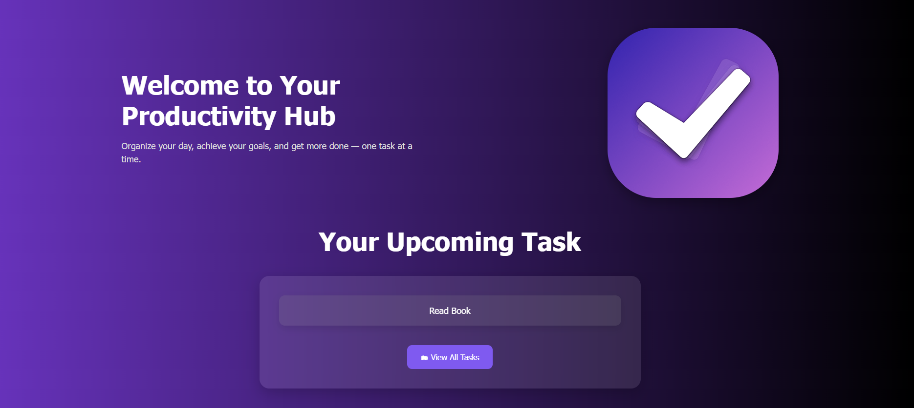
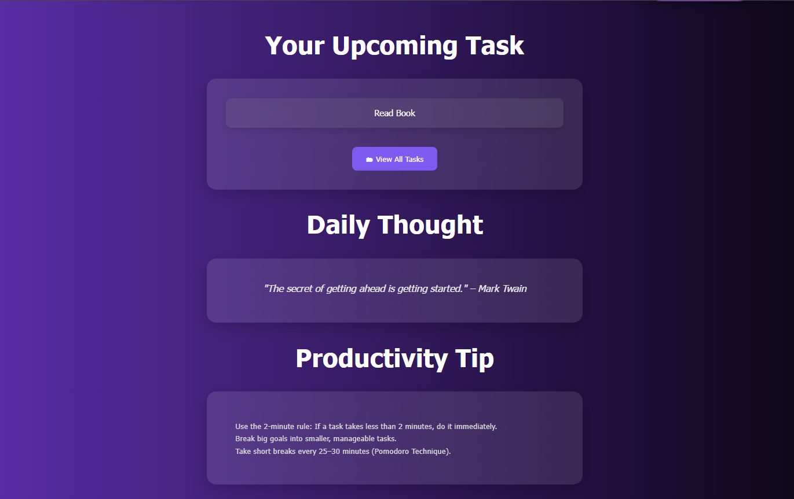
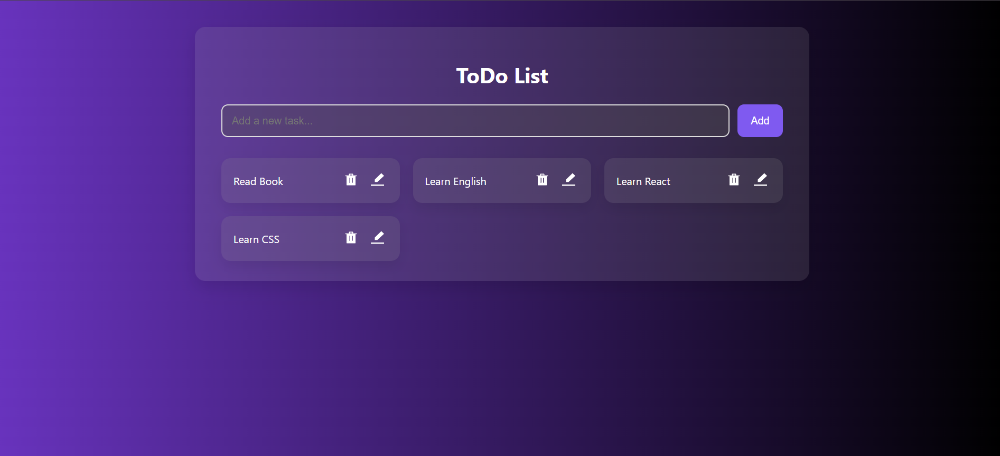
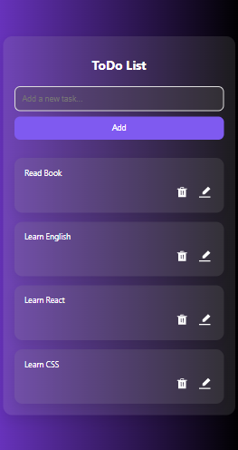
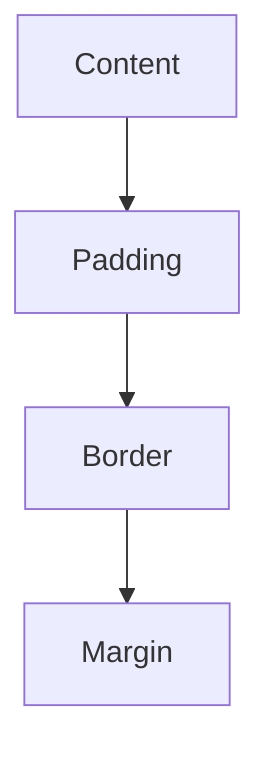

# ToDo List Web App

This project presents a complete task management experience with a stylized homepage and an interactive task listing interface. It integrates modern HTML, CSS, and JavaScript practices, featuring a vibrant swag-inspired design, localStorage-based persistence, and responsive layouts using Flexbox and dynamic CSS techniques.

## Assignment Output

| View Type        | Screenshot 1                               | Screenshot 2                               | Screenshot 3                               |
| ---------------- | ------------------------------------------ | ------------------------------------------ | ------------------------------------------ |
| **Desktop View** |  |  |  |
| **Mobile View**  |    |

## Overview

The project consists of two main sections:

1. **Homepage (`home-page.html`)**

   * Acts as a dashboard with motivational elements, a featured task display, and action prompts.
   * Features stylized call-to-action buttons to encourage user interaction.

2. **Task Grid Interface (`todo-list.html`)**

   * A full-featured ToDo list manager.
   * Supports task addition, editing, deletion, and local storage persistence.
   * Displays tasks in a card-based layout with grid alignment.

## Core Features

| Feature                    | Description                                                         |
| -------------------------- | ------------------------------------------------------------------- |
| Responsive Hero Section    | Built using Flexbox to ensure adaptability across screen sizes      |
| Task Management            | Users can add, edit, or delete tasks with instant DOM updates       |
| Persistent Storage         | Tasks are saved and retrieved using `localStorage`                  |
| Motivational Dashboard     | Displays productivity quotes and tips dynamically                   |
| Visual Design Enhancements | Uses `box-shadow`, `text-shadow`, gradients, and glow effects       |
| Reusable Card Component    | Both homepage and task interface use styled `.todo-card` containers |

## Concepts Used

| Concept                | Description                                                            |
| ---------------------- | ---------------------------------------------------------------------- |
| Box Model              | Controls element spacing through `padding`, `border`, and `margin`     |
| Flexbox                | Used for horizontal and vertical alignment in hero and layout sections |
| Grid Layout (Optional) | Enhances alignment in the task list container                          |
| Responsive Typography  | Achieved using `clamp()` for scalable font sizing                      |
| Local Storage          | Data persistence using `localStorage.getItem` and `setItem`            |
| Event Handling         | JavaScript event listeners manage button actions dynamically           |
| Gradient Backgrounds   | Created using `linear-gradient` for visual depth and style             |
| Glassmorphism          | Achieved using `backdrop-filter: blur(10px)` for container UI          |

## Box Model Diagram (Mermaid)



Each task card and layout container respects the box model to ensure proper alignment and spacing within and across elements.

## JavaScript Functionality

### Loading Featured Task on Homepage

```javascript
const savedList = localStorage.getItem("todoList");
if (savedList) {
  const temp = document.createElement("div");
  temp.innerHTML = savedList;
  const firstTask = temp.querySelector(".todo-card span");
  if (firstTask) {
    container.innerHTML = `<span>${firstTask.textContent}</span>`;
  } else {
    container.innerHTML = "<span>No tasks found.</span>";
  }
}
```

**Purpose:**
Dynamically fetches and displays the first saved task from the ToDo list on the homepage.

### Adding and Editing Tasks in the Grid UI

```javascript
editBtn.addEventListener("click", () => {
  const newTask = prompt("Edit your task:", taskSpan.textContent);
  if (newTask !== null) {
    taskSpan.textContent = newTask;
    localStorage.setItem("todoList", todoList.innerHTML);
  }
});
```

**Purpose:**
Allows the user to edit an existing task directly in the UI, updating both the DOM and `localStorage`.

### Deleting Tasks

```javascript
deleteBtn.addEventListener("click", () => {
  card.remove();
  localStorage.setItem("todoList", todoList.innerHTML);
});
```

**Purpose:**
Removes a task from both the UI and `localStorage`.

## Visual Styling Breakdown

| Element         | Styling Approach                                                             |
| --------------- | ---------------------------------------------------------------------------- |
| Background      | `linear-gradient(to right, #6833bd, #000000)` for a swag-themed gradient     |
| Text Headings   | `clamp()` used for scalable responsive font sizes                            |
| Glow Effects    | `text-shadow` for titles, `box-shadow` for cards and buttons                 |
| Card Components | Rounded corners and shadows for depth using `border-radius` and `box-shadow` |
| Call-to-Action  | Styled buttons with hover states using transitions and background contrast   |
| Section Blur    | `backdrop-filter: blur(10px)` for a modern glassmorphism feel                |

## Accessibility and Responsiveness

* Semantic HTML is used to ensure screen readers can interpret the page meaningfully.
* Flexbox and clamp-based font sizing ensure the app is usable on mobile, tablet, and desktop screens.
* Interactive buttons have visual hover feedback and logical tab order for accessibility.

## Final Notes

* The homepage acts as a motivational and organizational landing zone.
* The task interface is clean, responsive, and supports real-time task interactions.
* Both UI components use a consistent visual style to create a seamless experience.
* No backend or framework is required — everything works client-side using vanilla JavaScript and CSS.
