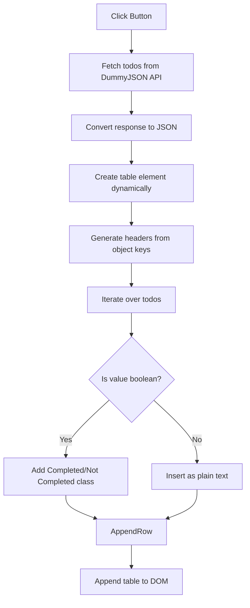
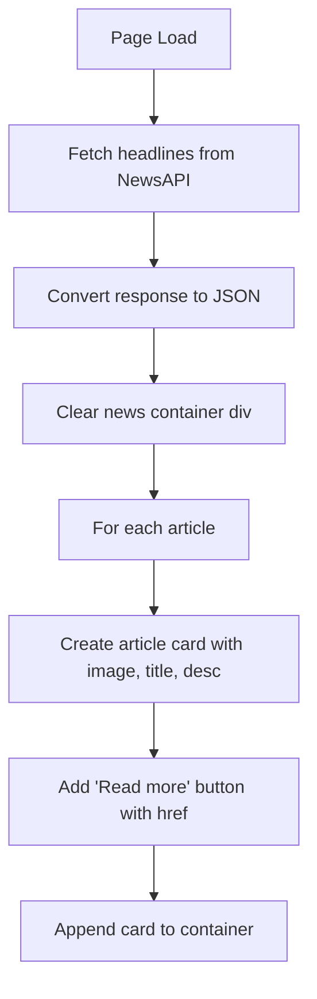
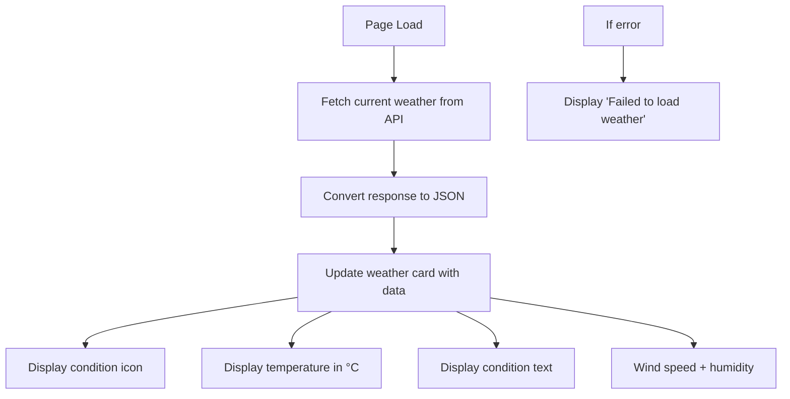

# Fetch Data from Public APIs

This repository contains **three interactive web projects** built with HTML, CSS, and JavaScript. Each project integrates external APIs or dynamic DOM manipulation, showcasing practical use of modern front-end concepts.

## Project 1: Todo Table App

This project fetches **Todo items** from the [DummyJSON API](https://dummyjson.com/todos) and dynamically generates a styled table with completion status indicators.

### Assignment Output

| View Type        | Screenshot 1                                                    |
| ---------------- | --------------------------------------------------------------- |
| **Desktop View** |  |

### Overview

* Fetches todo data from a REST API.
* Dynamically creates a table structure using JavaScript.
* Displays task details with clear **Completed / Not Completed** status indicators.
* Uses styled CSS classes for readability and visual emphasis.

### Core Features

| Feature                | Description                                                           |
| ---------------------- | --------------------------------------------------------------------- |
| API Integration        | Uses `fetch` to retrieve todos from DummyJSON                         |
| Dynamic Table Creation | Table headers and rows generated from API response keys               |
| Status Highlighting    | Boolean values mapped to “Completed” (green) or “Not Completed” (red) |
| Modern Styling         | Uses CSS transitions, border styling, and semantic table layout       |

### Concepts Used

| Concept             | Description                                                                |
| ------------------- | -------------------------------------------------------------------------- |
| DOM Manipulation    | Creation of `<table>`, `<tr>`, `<td>`, `<th>` elements dynamically         |
| API Fetching        | `fetch().then().then()` flow for async data retrieval                      |
| Conditional Styling | CSS classes `.completed` and `.not-completed` applied based on values      |
| Table Semantics     | `<thead>`, `<tbody>`, and `border-collapse` for structured tabular display |

### JS Control Flow

## Project 2: US Top Headlines App

This project fetches **Top Headlines** from [NewsAPI](https://newsapi.org/) for the **United States** and displays them in a **card-based responsive layout**.

### Assignment Output

| View Type        | Screenshot 1                                                        |
| ---------------- | ------------------------------------------------------------------- |
| **Desktop View** |  |

### Overview

* Retrieves real-time top headlines using NewsAPI.
* Articles displayed in **card layout** with image, title, description, and “Read more” link.
* Responsive design using **CSS Grid**.
* Hover animations for interactivity.

### Core Features

| Feature         | Description                                                          |
| --------------- | -------------------------------------------------------------------- |
| API Integration | Fetches `https://newsapi.org/v2/top-headlines?country=us`            |
| Responsive Grid | `grid-template-columns: repeat(auto-fit, minmax(250px, 1fr))` layout |
| Article Cards   | Each card includes image, title, description, and external link      |
| Hover Animation | Cards elevate and scale on hover                                     |

### Concepts Used

| Concept           | Description                                                            |
| ----------------- | ---------------------------------------------------------------------- |
| CSS Grid          | Used for adaptive layout across devices                                |
| DOM Creation      | Articles dynamically inserted as `.article` cards                      |
| API Fetch + Async | Uses `async/await` for fetching API data                               |
| Media Queries     | Ensures typography and card layout adjust for smaller screens          |
| Transitions       | `transform` and `box-shadow` applied on hover for smooth UI animations |

### JS Control Flow

## Project 3: Weather App

This project fetches and displays **real-time weather information** for **Ahmednagar** using [WeatherAPI.com](https://www.weatherapi.com/).

### Assignment Output

| View Type        | Screenshot 1                                                     |
| ---------------- | ---------------------------------------------------------------- |
| **Desktop View** |  |

### Overview

* Fetches **current temperature, condition, wind speed, and humidity**.
* Displays data in a **card with weather icon and stats**.
* Smooth hover animation for card elevation.
* Uses gradient background for modern UI.

### Core Features

| Feature                 | Description                                                        |
| ----------------------- | ------------------------------------------------------------------ |
| API Integration         | Fetches weather from `api.weatherapi.com/v1/current.json`          |
| Weather Card UI         | Displays location, icon, temperature, condition, wind, humidity    |
| Responsive + Minimal UI | Centered weather card with shadows, gradients, and hover animation |
| Error Handling          | Shows “Failed to load weather” on API error                        |

### Concepts Used

| Concept              | Description                                                               |
| -------------------- | ------------------------------------------------------------------------- |
| Flexbox              | Aligns and centers `.weather-card` on page                                |
| Gradient Background  | `linear-gradient(to right, #74ebd5, #9face6)` used for depth effect       |
| DOM Updates          | Dynamically inserts weather details into card                             |
| API + Async Handling | `async/await` with try/catch for error handling                           |
| Card Design          | `border-radius`, `box-shadow`, and transitions for modern clean interface |

### JS Control Flow

# Final Notes

* Each project highlights **practical use of APIs, DOM manipulation, and responsive UI design**.
* Projects are lightweight, built with **vanilla HTML, CSS, and JavaScript** (no frameworks required).
* Screenshots provided demonstrate **final rendered outputs**.
* These can be extended into larger projects (task managers, news dashboards, or full weather apps).
