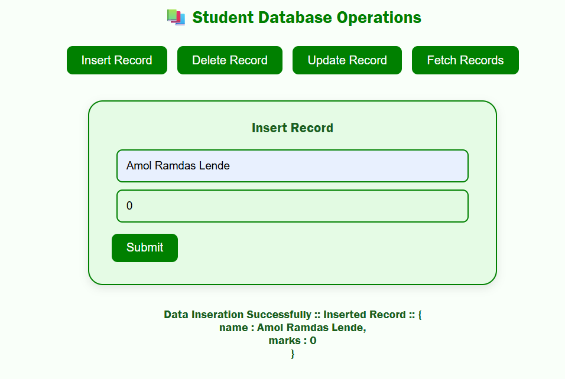
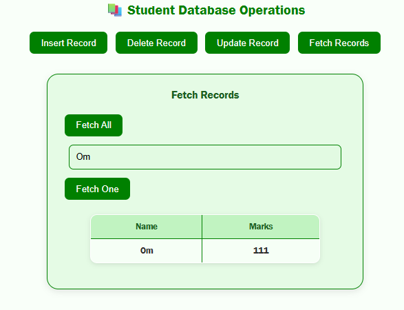
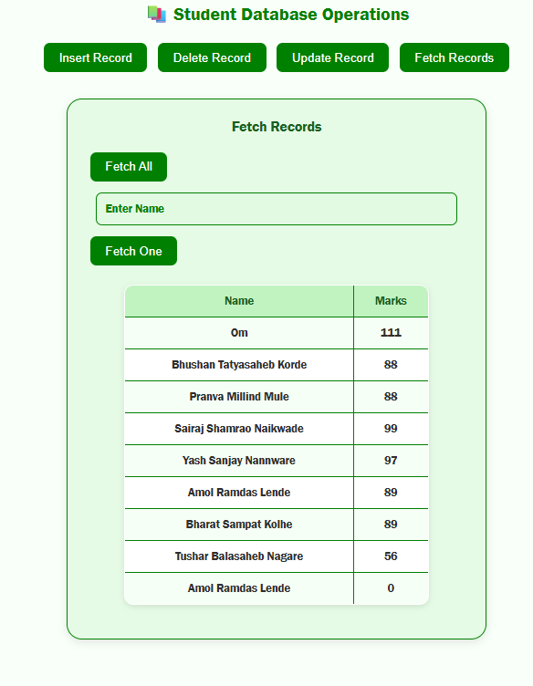
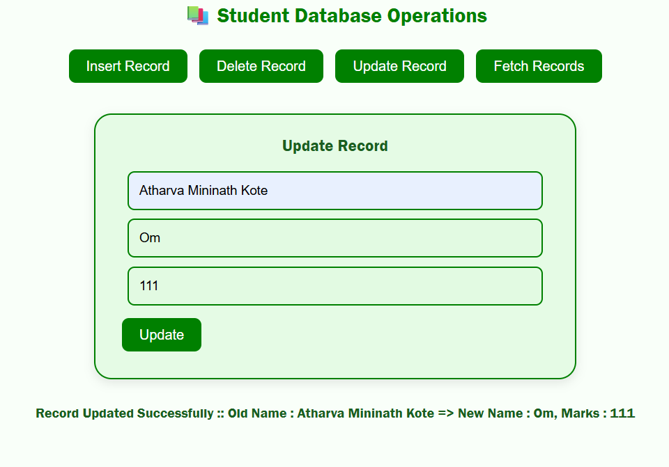
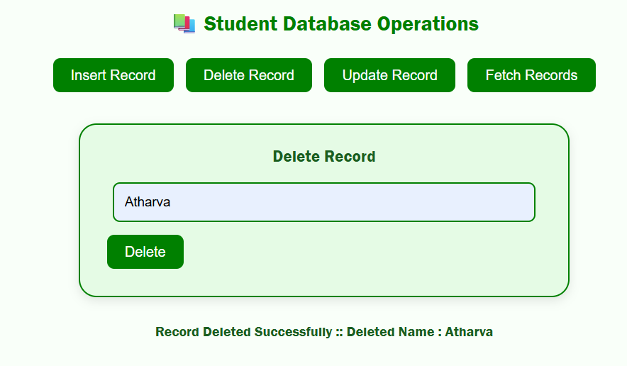
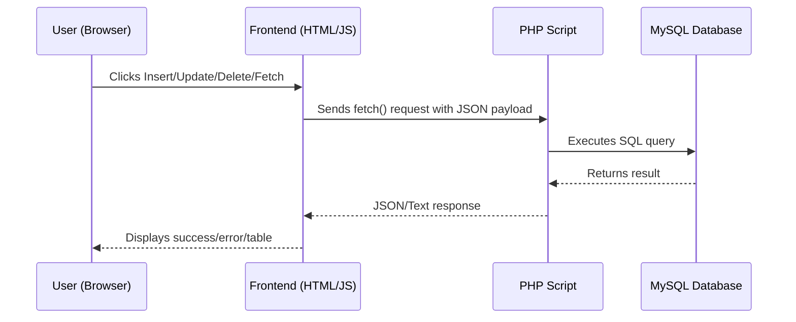

# Student CRUD Web App (PHP + MySQL)

This project implements a **complete CRUD system** (Create, Read, Update, Delete) for managing student records, powered by **PHP (server-side)** and **MySQL**. The **frontend (HTML + JavaScript)** acts as a client, sending `fetch()` API requests to PHP endpoints, which interact with the database and return JSON/text responses.


## Assignment Output

| Operation  | Screenshot 1                                              | Screenshot 2                                                      |
| ---------- | --------------------------------------------------------- | ----------------------------------------------------------------- |
| **Insert** |  |
| **Fetch**  |   |           |
| **Update** |  |                                                                   |
| **Delete** |  |                                                                   |


## Database Schema

```sql
CREATE DATABASE students;

USE students;

CREATE TABLE students_records (
  id INT AUTO_INCREMENT PRIMARY KEY,
  name VARCHAR(100) NOT NULL,
  mark INT NOT NULL
);
```


## Project Structure

```
/server
│── db-connect-test.php         # Tests connection to MySQL
│── MySQL-INSERT-data.php       # Handles record insertion
│── MySQL-UPDATE-data.php       # Handles record updates
│── MySQL-DELETE-data.php       # Handles record deletion
│── MySQL-FETCH-data.php        # Fetches one or all records
/frontend
│── index.html                  # Main client-side interface
```


## Backend (PHP) Features

| File                      | Responsibility                                             |
| ------------------------- | ---------------------------------------------------------- |
| **MySQL-INSERT-data.php** | Inserts new student records using prepared statements      |
| **MySQL-UPDATE-data.php** | Updates an existing record (name, marks) based on old name |
| **MySQL-DELETE-data.php** | Deletes a student record by name                           |
| **MySQL-FETCH-data.php**  | Fetches either all records or a single record by name      |
| **db-connect-test.php**   | Quick check to verify MySQL connection status              |


## Example Workflows

### Insert Record

**Request (JSON):**

```json
{
  "name": "Alice",
  "marks": 92
}
```

**Response (Text):**

```
Data Insertion Successfully :: Inserted Record :: {
    name : Alice,
    marks : 92
}
```


### Fetch All Records

**Request:**

```json
{}
```

**Response:**

```json
{
  "status": "success",
  "records": [
    { "name": "Alice", "mark": 92 },
    { "name": "Bob", "mark": 85 }
  ]
}
```


### Update Record

**Request (JSON):**

```json
{
  "old_name": "Alice",
  "new_name": "Alicia",
  "new_marks": 95
}
```

**Response (Text):**

```
Record Updated Successfully :: Old Name : Alice => New Name : Alicia, Marks : 95
```


### Delete Record

**Request (JSON):**

```json
{
  "name": "Bob"
}
```

**Response (Text):**

```
Record Deleted Successfully :: Deleted Name : Bob
```


## PHP Concepts Applied

| Concept                 | Implementation                                                               |
| ----------------------- | ---------------------------------------------------------------------------- |
| **JSON Handling**       | `file_get_contents("php://input")` + `json_decode()` for request parsing     |
| **Prepared Statements** | Secure queries using `$connection->prepare()` + `bind_param()`               |
| **Error Handling**      | Clear text/JSON responses on DB/statement errors                             |
| **Conditional Queries** | `MySQL-FETCH-data.php` handles both *fetch all* and *fetch one by name*      |
| **Connection Testing**  | `db-connect-test.php` ensures MySQL is available before running CRUD scripts |


## Frontend → Backend Communication




## Final Notes

* **Frontend** provides interaction and visualization.
* **PHP Backend** contains the core logic: inserts, updates, deletes, and fetches records securely.
* **MySQL Database** persists student data.
* **Scalable**: Can extend to include roll numbers, pagination, login-based access, etc.

